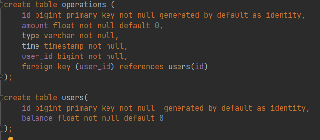

# FinalProject
### Rest API по работе с банковским счетом

---
Доступны следующие операции:

* Узнать баланс по ID пользователя;
* Снятие заданной суммы с баланса пользователя;
* Пополнение баланса на заданную сумму;
* Отобразить список операций за выбранный период;
* Перевести заданную сумму другому пользователю.

Ответ выдается в виде JSON.

# Операции API

### getBalance

---

| Параметры       | Значение           | Текстовое поле |
|-----------------|:-------------:|---------------:|
| Id пользователя | Ошибка  |          Причина ошибки |
|       | Текущий баланс пользователя      |             |

### takeMoney

---

| Параметры       |       Значение        | Текстовое поле |
|-----------------|:---------------------:|---------------:|
| Id пользователя | Недостаточно средств  |          Причина ошибки |
| Сумма           |         Успех         |             |

### putMoney

---

| Параметры       |       Значение        | Текстовое поле |
|-----------------|:---------------------:|---------------:|
| Id пользователя | Ошибка   |          Причина ошибки |
| Сумма           |         Успех         |             |

### getOperationList

---

| Параметры       | Результат |
|-----------------|:---------:|
| Id пользователя |  Дата операции   |
| Начало диапазона дат (параметр может быть пустым)           |   Тип операции   |
|  Конец диапазона дат (параметр может быть пустым)               |   Сумма операции        |

### transferMoney

___

| Параметры       |       Значение        | Текстовое поле |
|-----------------|:---------------------:|---------------:|
| Id пользователя | Ошибка   |          Причина ошибки  |
| Id получателя   |    Успех      |                         |
| Сумма           |                  |             |

## Скриншот базы данных

---

